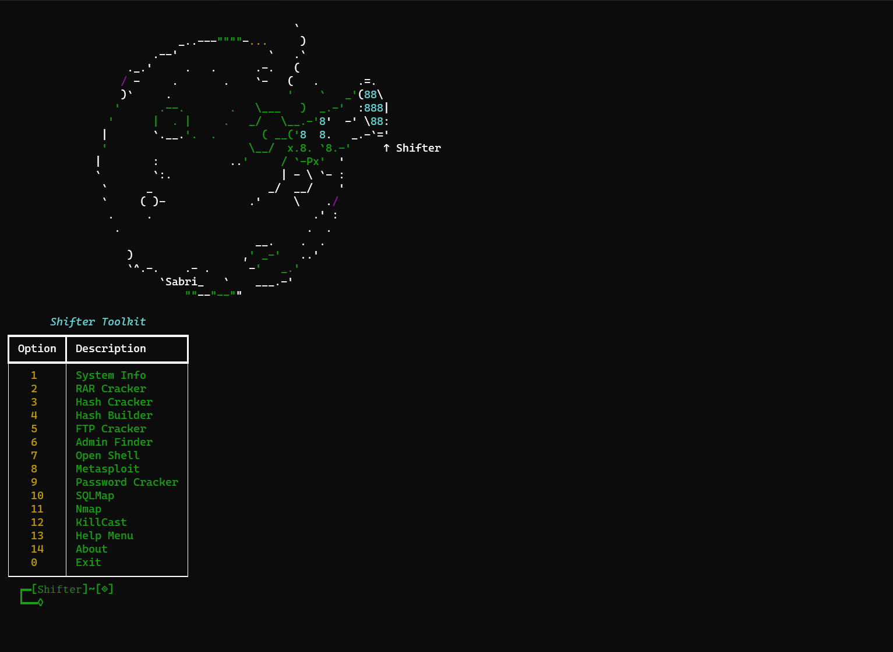

# 🔥 Shifter Toolkit

A powerful **Python-based security toolkit** that combines multiple tools into one interface.  
It includes system information, password cracking, FTP brute force, SQLMap, Nmap, Metasploit, and more.  

> ⚡ Educational purpose only. Use it responsibly.

---

## ✨ Features
- 📊 System Info
- 📂 RAR Cracker
- 🔑 Hash Cracker
- 🔐 Hash Builder (MD5)
- 🌐 FTP Cracker
- 🕵️ Admin Finder
- 💻 Open Shell
- 🎯 Metasploit Launcher
- 🔓 Password Cracker
- 💉 SQLMap Integration
- 📡 Nmap Scanner
- 🚀 KillCast
- 📖 Help Menu
- 👤 About

---

## ⚠️ Warning

This tool is created **for educational and research purposes only**.  
- ❌ Do not use it on systems you don’t own or don’t have explicit permission to test.  
- ⚖️ Unauthorized usage may be **illegal** and could lead to severe consequences.  
- ✅ Use it in **labs, CTFs, or penetration testing environments** where you have permission.  

By using this tool, you agree that the author has **no responsibility** for any misuse.

---

## 📸 Screenshots

### Main Menu


---

## ⚙️ Installation

```bash
git clone https://github.com/SabriAmir/shifter-tool.git
cd shifter-tool
pip install -r requirements.txt
python3 main.py

